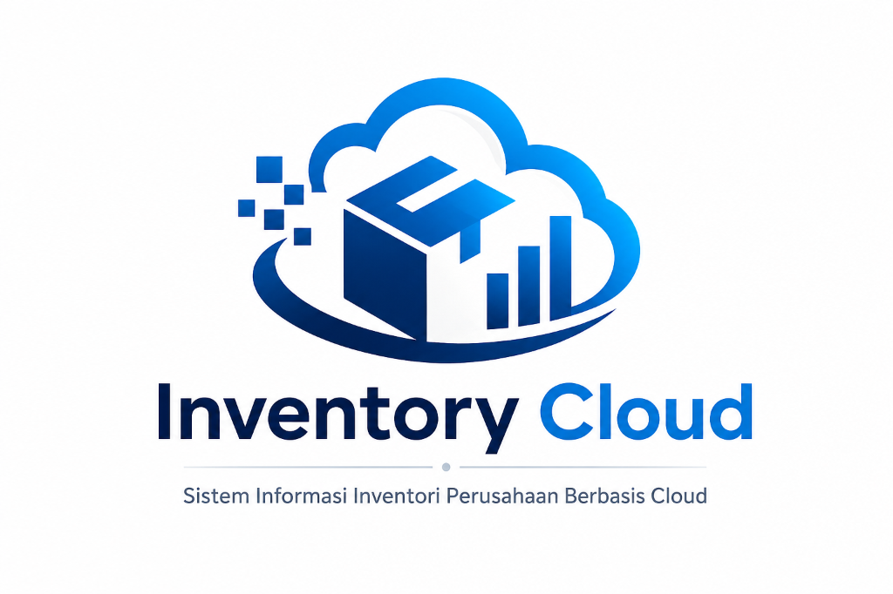
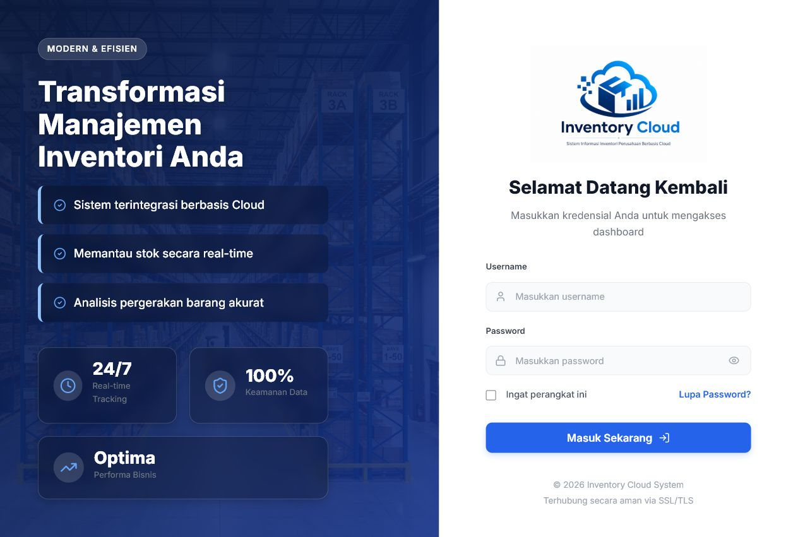

<div align="center">
  

  # Inventory Cloud

  **Sistem informasi inventori perusahaan berbasis web untuk memantau stok dan pergerakan barang secara terpusat.**

  [](https://react.dev/)
  [](https://laravel.com/)
  [](https://vite.dev/)
  [](https://www.mysql.com/)
  [](https://github.com/rahmawati6/sistem-inventori-perusahaan/actions/workflows/ci.yml)
  [](LICENSE)
</div>

## Tentang Proyek

Inventory Cloud membantu perusahaan mengelola data barang, mencatat barang masuk dan keluar, memantau kondisi stok, serta melihat laporan inventori melalui satu dashboard. Aplikasi dibangun sebagai *single-page application* dengan React pada frontend dan REST API Laravel pada backend.

## Fitur Utama

- Dashboard ringkasan stok dan aktivitas inventori
- Grafik barang masuk dan keluar dalam enam bulan terakhir
- Visualisasi stok berdasarkan kategori
- Pengelolaan data barang (*create*, *read*, *update*, dan *delete*)
- Pencatatan transaksi barang masuk dan barang keluar
- Laporan inventori terpusat
- Manajemen pengguna berdasarkan peran
- Autentikasi API menggunakan Laravel Sanctum
- Notifikasi interaktif untuk setiap aksi pengguna

## Tampilan Aplikasi

Screenshot berikut diambil langsung dari aplikasi yang dijalankan secara lokal dengan data hasil *seeding*.

### Halaman Login



### Dashboard


## Teknologi

| Bagian | Teknologi |
| --- | --- |
| Frontend | React 19, React Router 7, Axios, Recharts, Lucide React |
| Build Tool | Vite 6 |
| Backend | Laravel 10, Laravel Sanctum |
| Database | MySQL atau MariaDB |
| Styling | CSS |

## Struktur Proyek

```text
.
├── backend-laravel/    # REST API Laravel, migration, dan seeder
├── frontend-react/     # Aplikasi React
├── docs/               # Dokumentasi dan screenshot aplikasi
├── DEPLOYMENT.md       # Panduan deployment
└── README.md
```

## Persyaratan Sistem

Pastikan perangkat sudah memiliki:

- PHP 8.1 atau lebih baru
- Composer
- Node.js 18 atau lebih baru dan npm
- MySQL 8 atau MariaDB

## Instalasi dan Menjalankan Aplikasi

### 1. Clone repository

```bash
git clone https://github.com/rahmawati6/sistem-inventori-perusahaan.git
cd sistem-inventori-perusahaan
```

### 2. Siapkan backend

```bash
cd backend-laravel
composer install
cp .env.example .env
php artisan key:generate
```

Untuk Windows PowerShell, gunakan perintah berikut sebagai pengganti `cp`:

```powershell
Copy-Item .env.example .env
```

Buat database MySQL, lalu sesuaikan konfigurasi berikut di dalam `backend-laravel/.env`:

```env
DB_CONNECTION=mysql
DB_HOST=127.0.0.1
DB_PORT=3306
DB_DATABASE=db_inventory_laravel
DB_USERNAME=root
DB_PASSWORD=
```

Jalankan migration, seeder, dan server API:

```bash
php artisan migrate --seed
php artisan serve
```

Backend akan tersedia di `http://localhost:8000`.

### 3. Siapkan frontend

Buka terminal baru dari direktori utama proyek:

```bash
cd frontend-react
npm install
npm run dev
```

Frontend akan tersedia di `http://localhost:5173`.

Jika backend dijalankan pada alamat lain, buat file `frontend-react/.env` dan atur URL API:

```env
VITE_API_URL=http://localhost:8000/api
```

## Akun Demo

Gunakan akun bawaan dari `UserSeeder` setelah menjalankan proses seeding:

| Field | Nilai |
| --- | --- |
| Username | `admin` |
| Password | `admin123` |
| Role | Admin |

> Akun ini hanya ditujukan untuk lingkungan pengembangan. Ganti kredensial sebelum aplikasi digunakan pada lingkungan produksi.

## Build untuk Produksi

```bash
cd frontend-react
npm run build
```

Panduan deployment yang lebih lengkap tersedia di [DEPLOYMENT.md](DEPLOYMENT.md).

## Kontribusi

Kontribusi sangat terbuka. Baca [CONTRIBUTING.md](CONTRIBUTING.md) untuk panduan pengembangan, standar commit, dan proses pengajuan *pull request*.

Untuk mengusulkan perubahan:

1. *Fork* repository ini.
2. Buat branch baru (`git checkout -b feature/nama-fitur`).
3. Commit perubahan (`git commit -m "feat: menambahkan nama fitur"`).
4. Push branch (`git push origin feature/nama-fitur`).
5. Buat *pull request*.

## Catatan Keamanan

Jangan memasukkan file `.env`, kredensial database, token, atau data sensitif lainnya ke dalam repository. Jika menemukan celah keamanan, ikuti prosedur pelaporan privat di [SECURITY.md](SECURITY.md).

## Dokumentasi Komunitas

- [Panduan Kontribusi](CONTRIBUTING.md)
- [Kode Etik](CODE_OF_CONDUCT.md)
- [Kebijakan Keamanan](SECURITY.md)
- [Panduan Deployment](DEPLOYMENT.md)

## Lisensi

Proyek ini tersedia di bawah [MIT License](LICENSE). Anda bebas menggunakan, memodifikasi, dan mendistribusikannya sesuai ketentuan lisensi.

---

<div align="center">
  Dibuat untuk membantu pengelolaan inventori perusahaan menjadi lebih rapi, cepat, dan terukur.
</div>
